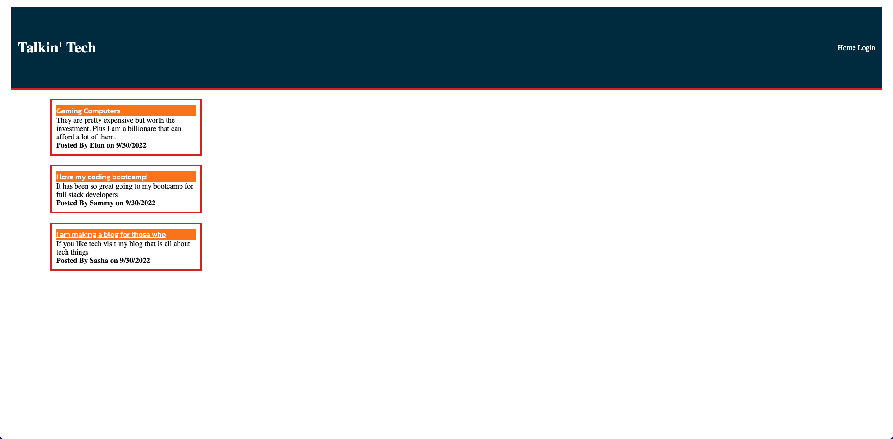
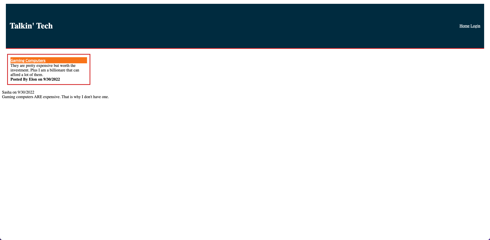

# Tech Blog

## Description

 Module 14 Challenge

This is a CMS-style tech blog where developers can come to create posts about all things tech.  Users can also comment on other posts that they read to discuss further on the subject.  Come and be a part of the conversation!

## Table of Contents

[User Story](#user-story) 
[Project Criteria](#project-criteria) 
[Installation](#installation) 
[Technologies Used](#technologies-used) 
[Preview](#preview) 
[Questions](#questions)

## User Story

AS A developer who writes about tech 
I WANT a CMS-style blog site 
SO THAT I can publish articles, blog posts, and my thoughts and opinions

## Project Criteria

GIVEN a CMS-style blog site 
WHEN I visit the site for the first time 
THEN I am presented with the homepage, which includes existing blog posts if any have been posted; navigation links for the homepage and the dashboard; and the option to log in 
WHEN I click on the homepage option 
THEN I am taken to the homepage 
WHEN I click on any other links in the navigation 
THEN I am prompted to either sign up or sign in 
WHEN I choose to sign up 
THEN I am prompted to create a username and password 
WHEN I click on the sign-up button 
THEN my user credentials are saved and I am logged into the site 
WHEN I revisit the site at a later time and choose to sign in 
THEN I am prompted to enter my username and password 
WHEN I am signed in to the site 
THEN I see navigation links for the homepage, the dashboard, and the option to log out 
WHEN I click on the homepage option in the navigation 
THEN I am taken to the homepage and presented with existing blog posts that include the post title and the date created 
WHEN I click on an existing blog post 
THEN I am presented with the post title, contents, post creator’s username, and date created for that post and have the option to leave a comment 
WHEN I enter a comment and click on the submit button while signed in 
THEN the comment is saved and the post is updated to display the comment, the comment creator’s username, and the date created 
WHEN I click on the dashboard option in the navigation 
THEN I am taken to the dashboard and presented with any blog posts I have already created and the option to add a new blog post 
WHEN I click on the button to add a new blog post 
THEN I am prompted to enter both a title and contents for my blog post 
WHEN I click on the button to create a new blog post 
THEN the title and contents of my post are saved and I am taken back to an updated dashboard with my new blog post 
WHEN I click on one of my existing posts in the dashboard 
THEN I am able to delete or update my post and taken back to an updated dashboard 
WHEN I click on the logout option in the navigation 
THEN I am signed out of the site 
WHEN I am idle on the site for more than a set time 
THEN I am able to view comments but I am prompted to log in again before I can add, update, or delete comments

## Installation

To install this application please clone repository 
After cloning please run `npm i` to install all packages 
Open a terminal in the db folder and run `mysql -u root -p` then enter your mysql password.  Then run `source schema.sql` and exit the terminal 
Then in your main terminal run `npm run seed` 
You can then run `npm start` to start the application and open the link found in the command line

## Technologies Used

[bcrypt](https://www.npmjs.com/package/bcrypt) 
[connect-session-sequelize](https://www.npmjs.com/package/connect-session-sequelize) 
[dotenv](https://www.npmjs.com/package/dotenv) 
[express](https://www.npmjs.com/package/express) 
[express-handlebars](https://www.npmjs.com/package/express-handlebars) 
[express-session](https://www.npmjs.com/package/express-session) 
[mysql2](https://www.npmjs.com/package/mysql2) 
[sequelize](https://www.npmjs.com/package/sequelize)

## Preview

Deployed with [Heroku](https://techy-talk.herokuapp.com/)

## Questions

If you have questions regarding this project or others you can reach me by: 
Email: kate.epatch@gmail.com 
Github: [katepatch](https://github.com/katepatch)
